# Consulta #1 Sql

## CONSULTAS SQL

1. Para visualizar toda la información que contiene la tabla `usuario` se puede incluir con la instrucción SELECT el caracter `*` o cada una de los campos de la tabla 

`SELECT * FROM usuario`
S
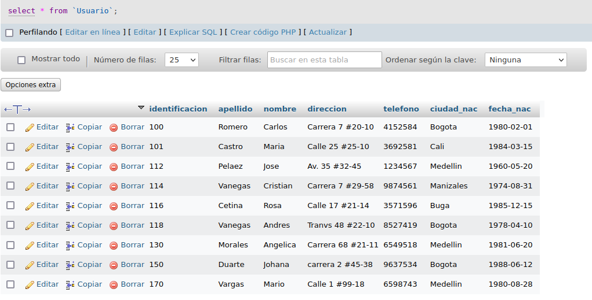
S
2. Seleccionar o visualizar solamente la identificación del usuario.

`SELECT Identificación FROM usuario`

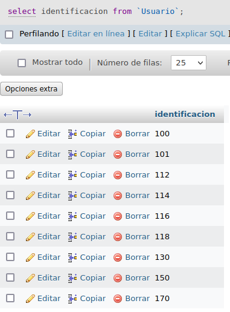

3. Si se desea obtener los registros cuya identificacion sean mayores o iguales a 150, se debe utilizar la consulta WHERE que especifica las condiciones que deben reunir los registros que se van a seleccionar-
S
`SELECT * FROM usuario WHERE identificacion >= 150`

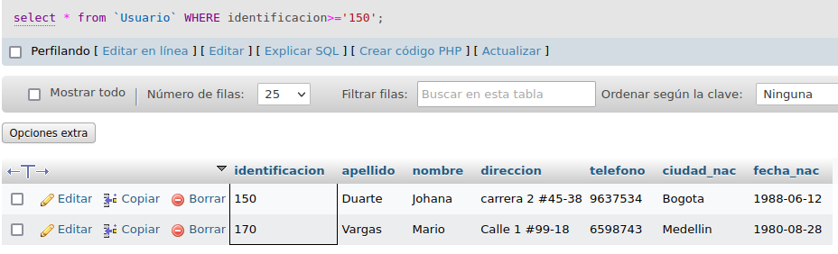

4. Si se desea obtener los registros cuyo sus apellidos sean Vanegas o Cetina, se debe utilizar el operador IN que especifica los registros 
`SELECT apellidos FROM usuario WHERE apellidos IN ('Vanegas', 'Cetina')`

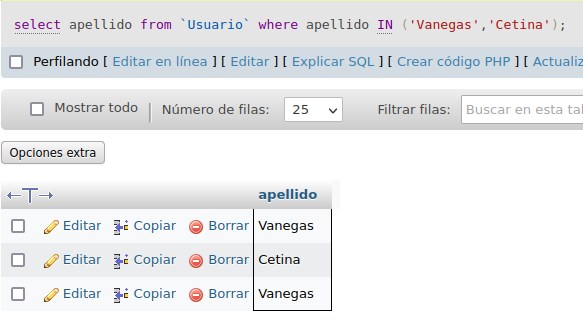

### O se puede utilizar el operador OR.

`SELECT apellidos FROM usuario WHERE apellidos='Vanegas' OR apellidos='Cetina'`

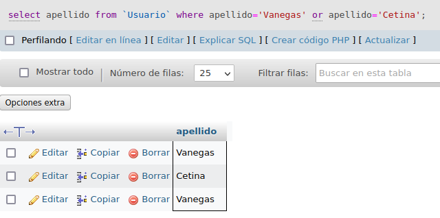

5. Si se desea obtener los registros cuya identificacion sea menor de '110' y la ciudad sea 'Cali', se debe utilizar el operador AND.

`SELECT * FROM usuario WHERE identificacion < 110 AND ciudad_nac='Cali'`

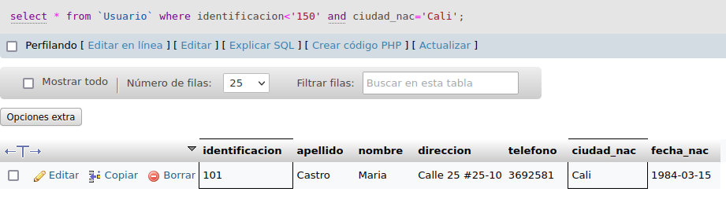

6. Si se desa obtener los registros cuyos nombres empiecen por la letra a, sebe utilizar l operador LIKE que utiliza los patrones "%" (todos) y '_' (caracter)

`select * from Usuario where nombre LIKE 'A%'`

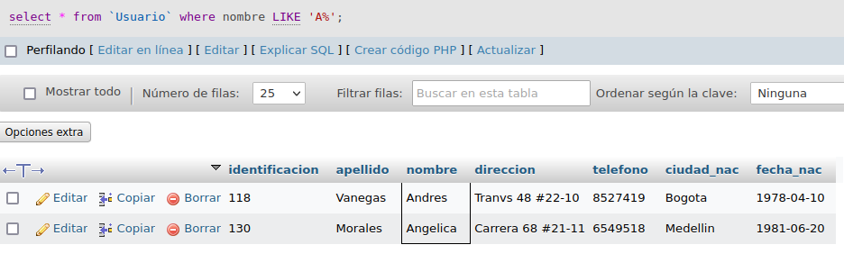

7. Se desea obtener los registros cuyos nombres tengan la letra a

`select * from Usuario where nombre LIKE '%a%'`

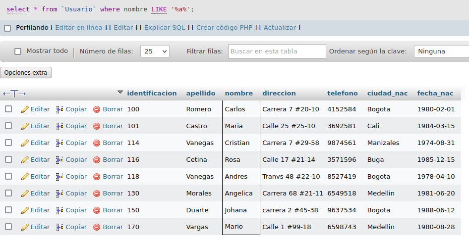

8. Si se desea obtener los regisro donde la cuarta letra de nomre sea una a

`select * from Usuario where nombre LIKE '___a%'`

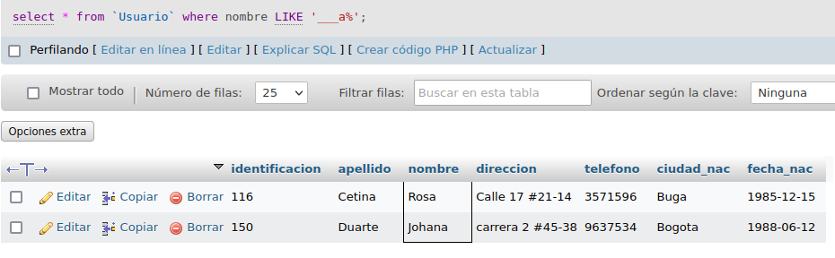

9. Si se desea obtener los registros cuya identificación este entre el intervalo 110 y 150, se debe utilizar la clausula BETWEEN, que sirve para especificr un intervalo de valores

`select * from Usuario where identificacion BETWEEN '110' and '150'`

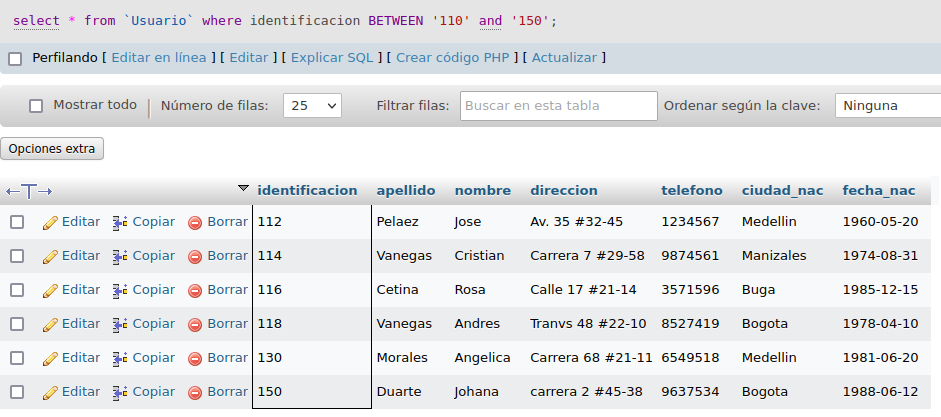

## COMANDO DELETE

10. Para eleminar solamente los registros cuya identificación sea mayor de 130 

`delete from Usuario where identficacion>'130'`

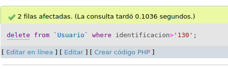

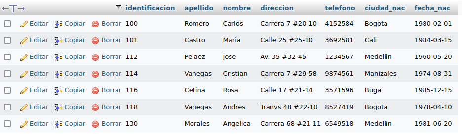

11. Para actualizar la ciudad de nacimiento de Cristian Vanegas cuya identificación es 114

`update Usuario set ciudad_nac = 'Manisalez' where identificacion='114'`

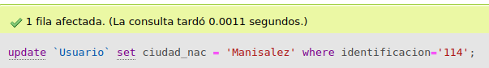

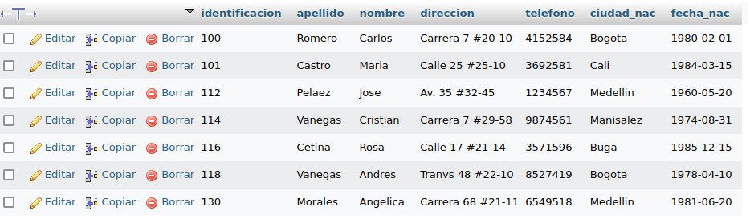

## INDER JOIN
Permite obtener datos de dos o mas tablas . Cuando se realiza la concatenación de las tablas , no necesariamente se deben mostrar todos los datos de las tablas .

## Tabla pedidos

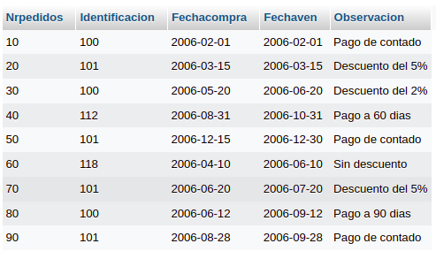

12. para visualizar los campos identificacion, nombre, apellidos de la tabla usuario y numero pedido, fecha de compra, fecha de vencimiento y observacion de la tabla pedidos se realiza la siguiente instruccion:

'SELECT usuario.identificacion, usuario.nombre, usuario.apellido, Pedidos.Nrpedidos, Pedidos.Fechacompra, Pedidos.Fechaven, Pedidos.Observacion FROM usuario INNER JOIN Pedidos ON usuario.identificacion = Pedidos.Identificacion;'

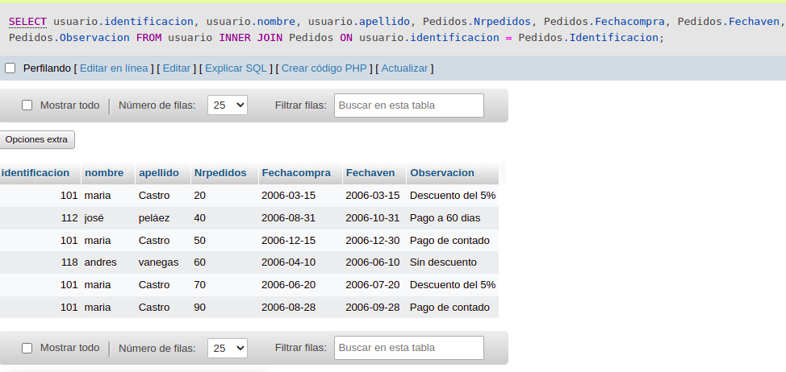

13. para visualizar todos los campos de las tablas ususarios y pedidos donde identificacion sea mayor que 100 se debe realizar la siguiente instruccion:

'SELECT usuario. *,pedidos.* FROM usuarios INNER JOIN pedidos ON Usuarios.identificacion = Pedidos.identificacion WHERE usuario.identificacion>100'

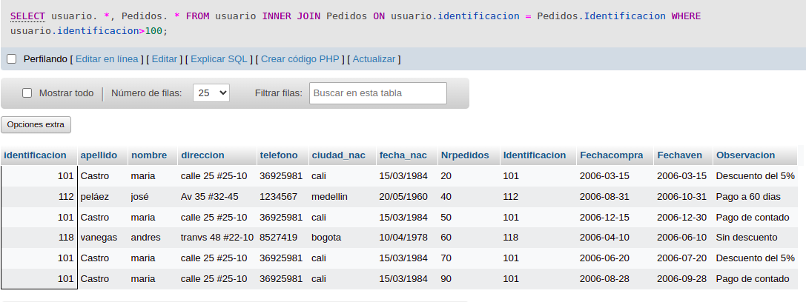